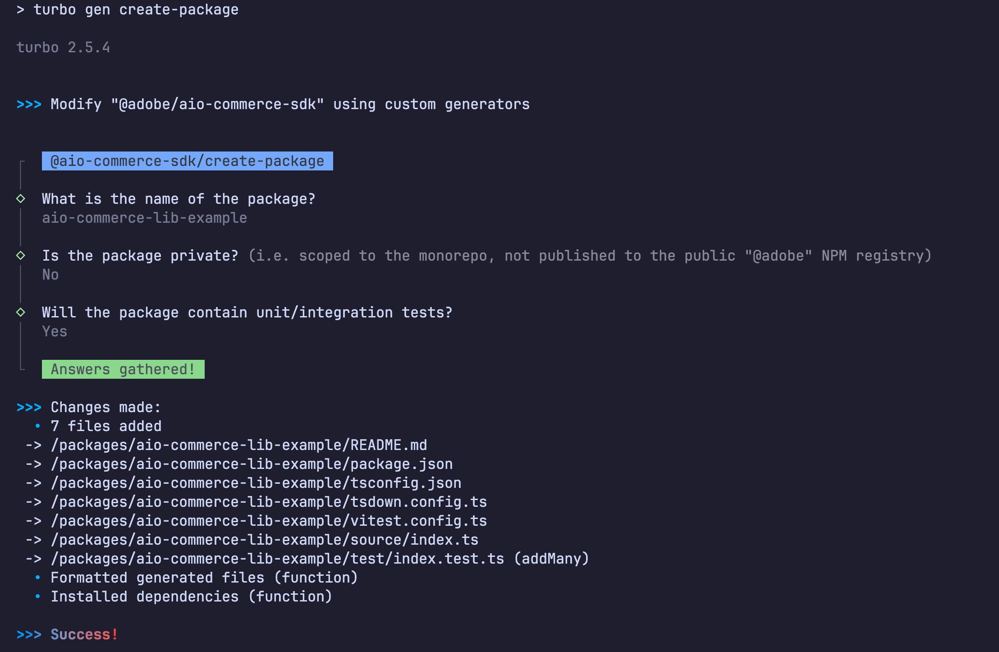

# Development

Thanks for choosing to contribute! The following are a set of guidelines to follow when developing this project. See also the [Contributing Guide](./CONTRIBUTING.md) for more information on contributing guidelines.

- [Development](#development)
  - [Overview](#overview)
  - [Prerequisites](#prerequisites)
  - [Project Standards](#project-standards)
  - [How to Develop](#how-to-develop)
  - [Testing](#testing)
  - [Prepare Your Package for Release](#prepare-your-package-for-release)
  - [Release Process](#release-process)

## Overview

This project contains a collection of packages that together form the Adobe Commerce SDK for App Builder applications. Each library is designed as a standalone, self-contained package that can be used independently in any App Builder app, following the same pattern as the [`@adobe/aio-*`](https://github.com/adobe?q=aio-lib&type=all) libraries.

In addition to these individual libraries, there's also the [`aio-commerce-sdk`](../packages/aio-commerce-sdk) package, which serves as a meta-package that re-exports selected libraries for convenience, similar to how the [`@adobe/aio-sdk`](https://github.com/adobe/aio-sdk) package works.

> [!IMPORTANT]
> The SDK should focus on re-exporting the most commonly used libraries and those that work together in similar contexts, rather than re-exporting every available library.

### PNPM Monorepo

This project is a [PNPM monorepo](https://pnpm.io/workspaces). PNPM is a faster and more efficient package manager for JavaScript compared to `npm`. When working with monorepos, `pnpm` is [recommended over `npm`](https://refine.dev/blog/pnpm-vs-npm-and-yarn/), with two of the main reasons being:

- Superior performance and space efficiency compared to `npm`

- Strict dependency isolation that prevents cross-package access issues. Unlike `npm`'s flattened `node_modules` structure, which allows any package to access dependencies from anywhere in the monorepo (even when not declared in its `package.json`), `pnpm` maintains proper isolation.
  - This prevents subtle, hard-to-trace bugs that commonly occur with `npm` in monorepo environments.

### Turborepo

This project uses [Turborepo](https://turbo.build/repo/docs), a build system designed for managing production-ready monorepos. Turborepo optimizes your development workflow through several key features:

- **Intelligent caching**: Turbo remembers the output of any task you run and skips work that's already been done.
  - Try running `turbo run build` twice in a row, and you'll see that the second time it's much faster. Then modify anything in a package or from a direct dependency, and run it again, you'll see that it's able to detect the changes and only rebuild (without cache) the affected packages.

  - At the time of writing, caching is only enabled locally. In the future, we might enable it for the CI pipeline.

- **Smart task orchestration**: Automatically detects and respects dependencies between packages, ensuring tasks execute in the correct order (e.g., if `pkg-b` depends on `pkg-a`, Turbo builds `pkg-a` first when you build `pkg-b`).

- **Parallel execution**: Maximizes resource utilization by running independent tasks simultaneously across all available cores.
  - Scripts like `lint`, `format:check`, `test`, can all be run in parallel, because they don't depend on each other and don't produce any output that could be affected by the order in which they are run.

> [!WARNING]
> The `turbo.json` file is the main configuration file for Turborepo. It defines the tasks that Turborepo will run, the dependencies between tasks, and the cache settings. The tasks there should be manipulated carefully, as they are used by the CI pipeline.

For detailed information on using Turborepo in this project, refer to the [official documentation](https://turbo.build/repo/docs).

## Prerequisites

- **`pnpm`**: See the `packageManager` field in the [package.json](../package.json) file for the recommended [`pnpm`](https://pnpm.io/installation) version.
- **`node`**: The [.nvmrc](../.nvmrc) file for the recommended [Node.js](https://nodejs.org/en) version.
  - If you have a node version manager installed, when you enter the working directory, it will automatically switch to the listed version.
    - We recommend using [`fnm`](https://github.com/Schniz/fnm) over [`nvm` ](https://github.com/nvm-sh/nvm), as it's much faster.

## Project Standards

### TypeScript

This project uses TypeScript exclusively. All source code must be written in TypeScript to ensure type safety, a better developer experience, and consistent code quality across the entire codebase.

Don't worry if you're not familiar with the language, as the project provides a complete TypeScript development framework with pre-configured tooling, type definitions, and IDE integration that makes it easy to work with it.

### ESM Over CommonJS

This project uses ECMAScript Modules (ESM) exclusively. All source code must be written in ESM to ensure compatibility with modern JavaScript and Node.js.

> [!NOTE]
> While we write all source code in ESM format, the build process generates bundles compatible with both ESM and CommonJS consumers. This dual compatibility is handled automatically by our build tool, TSDown. See [Configuring the build and exports](#configuring-the-build-and-exports) for more details.

If you're unfamiliar with the difference between ESM and CommonJS, we recommend reading [this article](https://betterstack.com/community/guides/scaling-nodejs/commonjs-vs-esm/). In short, CommonJS (CJS, `require()`) is the legacy module system introduced in Node.js in 2009. It became the de facto standard for many years due to being the only module system supported in Node.js.

While Node.js still supports CommonJS and many libraries continue to use it, ECMAScript Modules (ESM, `import/export`) have been the official standard since Node.js 13 and should be the default choice. It offers several key advantages over CommonJS, including:

- **Better tree-shaking and tooling**: ESM’s static `import/export` syntax enables bundlers to remove unused code and helps IDEs and type checkers work more efficiently.
  - There are some bundlers that support tree-shaking CJS code, but in a much more limited way.

- **Easier interoperability and gradual adoption**: ESM has always been able to `import` CommonJS modules directly, but not the other way around. Starting from Node.js 22, `require()` an ESM module is also supported, but if you have an older version of Node.js you'll not be able to.

- **Long-term compatibility with the ecosystem**: ESM is the standard module system of JavaScript. Node.js and modern tooling (e.g. Vite, Bun, Deno) are all centered around ESM going forward. Starting with ESM avoids future migration pain.

### Documentation

Each package should provide its own documentation through both written guides (in Markdown) and inline code comments. We use JSDoc as our standard for documenting source code.

> [!TIP]
> To maintain consistent documentation, you can draft your content and use AI to rewrite it in the style of existing packages, providing them as reference examples.

When working with JSDoc in TypeScript, keep these guidelines in mind:

- **Avoid duplicating type information**: TypeScript already provides static typing, so there's no need to repeat it.
  - Use `@param name` instead of `@param {Type} name`.
  - Avoid `@returns {Type} description` or similar, just use `@returns description`.

- **Document public APIs at least**: Internal helpers or types usually don't need detailed JSDoc unless complex or reused across modules. But the exported symbols of a package **should all be documented**.

- **Use `@example` to show correct usage**: If a function or method is used in a non-obvious way, include an `@example` tag to show correct usage.

- **Consistency matters**: Use consistent phrasing, punctuation, and formatting across packages. If you're unsure, follow conventions already used in existing packages.

### Creating a New Package

Turborepo supports generating new packages via its [`turbo gen`](https://turborepo.com/docs/guides/generating-code) command. This repository implements a custom generator `create-package` for this purpose. To create a new package, run the following command:

```shell
# Or just `pnpm turbo gen` and select `create-package` from the list of generators.
pnpm turbo gen create-package
```

This will prompt you for package configuration details, such as whether to include tests or set it as private, before generating the new package in the `packages` directory.

> [!TIP]
> The `create-package` generator will automatically setup the tooling configurations for the new package.



> [!NOTE]
> The `create-package` generator will create the new package in the `packages` directory by default (or `packages/internal` if private). If you want it in another directory, feel free to move it after it's created. You may also want to remove files that you don't need. In any case, make sure of the following:
>
> - The `pnpm-workspace.yaml` file contains the directory where it has been moved (see [docs](https://pnpm.io/workspaces)).
> - The `repository.directory` field in the `package.json` file is modified to reflect the new location (only applicable if the package is public).

#### About private packages

The generator will ask you if you want to make the package private. If you do, the `private` field in the `package.json` file will be set to `true`, and the name will be prefixed with `@aio-commerce-sdk/` to make it a scoped to the monorepo.

> [!IMPORTANT]
> It is important to understand that private/internal packages are not published and must be referenced via the `@aio-commerce-sdk/` scope, while public packages will be published to the `npm` registry, and they are referenced via the `@adobe/` scope. Examples of private packages are:
>
> - [`@aio-commerce-sdk/config-typescript`](../configs/typescript)
> - [`@aio-commerce-sdk/config-tsdown`](../configs/tsdown)

### Using Monorepo Packages as Dependencies

Any package within the monorepo can be used as a dependency by another package. This is accomplished using the [`workspace:` protocol](https://pnpm.io/workspaces#workspace-protocol-workspace), which ensures that `pnpm` will only resolve to local workspace packages and never fetch from the npm registry.

When using the `workspace:` protocol, you can specify version ranges just like with regular semver, but `pnpm` will only link packages that exist locally in your workspace. If a matching version isn't found in the workspace, the installation will fail rather than falling back to the registry. This provides certainty that you're always using your local development versions.

If instead of using the workspace version of a package, you want to use a published version, you can use the normal syntax for semver ranges, like `^1.0.0` or `~1.0.0`. Note that, for private packages, there is no published version to adhere to (no public package to pull from the registry), so you should only use the `workspace:*` syntax.

```json
{
  "dependencies": {
    "@adobe/aio-commerce-lib-example": "^1.0.0",
    "@adobe/aio-commerce-lib-other": "workspace:*"
  },
  "devDependencies": {
    "@aio-commerce-sdk/config-typescript": "workspace:*"
  }
}
```

> [!IMPORTANT]
> When the package is published, the `workspace:*` syntax is automatically translated to the latest version of the package (the local one). Make sure you take this into account when using it as a dependency, as you might eventually include a breaking change that you didn't account for.

The above example shows how to:

- Use a published version of a public package (`@adobe/aio-commerce-lib-example`) as a `dependency`.
- Use the workspace version of a public package (`@adobe/aio-commerce-lib-other`) as a `dependency`.
- Use the workspace version of a private package (`@aio-commerce-sdk/config-typescript`) as a `devDependency`.

### Code Style

> [!TIP]
> The `create-package` generator will automatically setup a Biome configuration for your package.

This project ensures a consistent code style by using [Biome](https://biomejs.dev/) for linting and formatting. Biome is a modern, fast, and configurable linter and formatter that replaces the usual combination of `eslint` and `prettier`. It works with JSON, JavaScript, and TypeScript ([among other languages](https://biomejs.dev/internals/language-support/)) out of the box, no plugins required.

To avoid unnecessary debates around code style (since everyone has their preferences), we've configured it using the [`ultracite` preset](https://github.com/haydenbleasel/ultracite), an opinionated collection of rules carefully selected to maintain consistency. This preset is AI-ready, meaning it includes specialized AI-friendly rule files that align with the code style, ensuring that AI-generated code also meets the standards. These are:

- An `ultracite.mdc` file in `.cursor/rules`, to be used by Cursor.
- A `copilot-instructions.md` file in the `.github/` directory, to be used by GitHub Copilot.

> [!IMPORTANT]
> Please, **refrain from modifying the root** configuration to adjust it to your liking, or to disable any rule that you don't like. Each package should use it's own configuration file that extends from the root one. Biome has a special `//` syntax to reference the root configuration file in monorepos, so you can do this very easily:
>
> ```json
> {
>   "extends": "//"
> }
> ```
>
> Know that you can also [supress rules](https://biomejs.dev/analyzer/suppressions/) if you need to, although we don't recommend it unless you're sure you need to. If you're not able to understand what the rule is complaining about, feel free to ask for clarification, or use AI to help you understand the rule and fix the underlying issue.

#### Markdown Formatting

At the time of writing, Biome doesn't fully support linting and formatting Markdown files. To workaround this, we've configured a `format:markdown` script in the root `package.json` file, that uses [Prettier](https://prettier.io/) to format them.

> [!NOTE]
> There's no configuration file for Prettier included in the project, as the opinionated defaults are good enough for Markdown.

#### Pre-commit hook

> [!IMPORTANT]
> This hook **WILL MODIFY** your staged files to try and fix the code style issues. It will only apply safe fixes and non-destructive changes. If you have some files that can't be automatically fixed by the tool, the commit will fail and you'll need to fix the issues manually.

To ensure a consistent code style, we've configured a `pre-commit` hook via [`husky`](https://typicode.github.io/husky/). It uses [`lint-staged`](https://github.com/okonet/lint-staged) to lint and format your staged files. This hook is automatically installed when you run `pnpm install` the first time, and doesn't require any manual or additional configuration.

### Generating an API Reference from your code

> [!TIP]
> The `create-package` generator will automatically setup TypeDoc for your package.

We use [TypeDoc](https://typedoc.org/) with the [TypeDoc Markdown Plugin](https://typedoc-plugin-markdown.org/docs) for generating API reference documentation. These tools automatically generate comprehensive Markdown documentation from JSDoc annotations in your TypeScript source code, allowing you to maintain documentation alongside your code and ensuring it stays up to date.

See the base configuration in the [`@aio-commerce-sdk/config-typedoc`](../configs/typedoc/typedoc.json) package.

## How to Develop

First, clone the repository, then `cd` into it and run `pnpm install` to install the dependencies.

```shell
git clone git@github.com:adobe/aio-commerce-sdk.git

# Make sure you don't use `npm` or `yarn`.
cd aio-commerce-sdk
pnpm install
```

### Setup Your Editor

In order to make the most of your development experience, we recommend you use a VSCode-based editor, but feel free to use any other editor you prefer. The project includes some editor-specific configuration files to help you get started.

<details>
<summary><strong>VSCode</strong></summary>
<p></p>

In the `.vscode/` directory, you'll find the following files:

- `extensions.json`: A list of recommended extensions for VSCode. VSCode will prompt you to install the recommended extensions when you open the project.
- `settings.json`: A set of VSCode settings to streamline you editor experience. It configures some settings to make your life easier, like auto-formatting or code-fixing on save.

<strong>Cursor</strong>

Because Cursor is a VSCode-based editor, it will automatically pick up the `.vscode/` directory and use the settings and extensions defined there. As we explained in the [Code Style](#code-style) section, we've configured a set of rules for Cursor to help you write code that meets the project's code style, which you can find in the `.cursor/rules/` directory.

</details>

<p></p>

<details>
<summary><strong>JetBrains</strong></summary>
<p></p>

JetBrains IDEs, such as [WebStorm](https://www.jetbrains.com/webstorm/) or [IntelliJ IDEA](https://www.jetbrains.com/idea/), work well for developing in this project. However, configuring them requires more manual setup compared to VSCode's shared `settings.json` approach.

Here are some guidelines to achieve a similar development experience:

1. Install the [Biome](https://plugins.jetbrains.com/plugin/22761-biome), [Inspection Lens](https://plugins.jetbrains.com/plugin/19678-inspection-lens), and [Prettier](https://plugins.jetbrains.com/plugin/10456-prettier) plugins.
   1. Configure Prettier to run exclusively on Markdown files and Biome on all other file types to prevent conflicts. Ensure the ESLint plugin is disabled or uninstalled, as it may interfere with Biome.
2. Set up automatic execution of the `assist:apply`, `format`, and `lint:fix` scripts on file save.
   1. Refer to the documentation on [File Watchers](https://www.jetbrains.com/help/idea/using-file-watchers.html) and [Actions on Save](https://www.jetbrains.com/help/idea/saving-and-reverting-changes.html#actions-on-save) for configuration details.
3. Create [Run Configurations](https://www.jetbrains.com/help/idea/run-debug-configuration.html) according to your preferences.

</details>

## Testing

> [!TIP]
> The `create-package` generator will automatically setup testing for your package if you select to include it.

Testing is conducted on a per-package basis. While not all packages require tests (particularly those without source code), you should include them whenever applicable.

We use [Vitest](https://vitest.dev/) as our testing framework, which is a faster and more modern alternative [that replaces Jest](https://www.speakeasy.com/blog/vitest-vs-jest). Unlike the latter, Vitest provides native TypeScript support without requiring additional transpilers like Babel.

Similarly to other tooling configurations, we've created a base configuration in the [`@aio-commerce-sdk/config-vitest`](../configs/vitest/vitest.config.js) package. Your package testing configuration should extend from it, and then override the parts that are specific to your package.

Complete documentation is available on the [Vitest website](https://vitest.dev/).

## Prepare Your Package for Release

This section guides you through preparing your package for release, covering build configuration, export setup, and ensuring proper tree-shaking support.

### Configuring the build

Packages in this repository are built with [TSDown](https://tsdown.dev/), a specialized tool for TypeScript library development. TSDown enables dual-format bundling that supports both CommonJS and ESM consumers (among other formats), while also providing tree-shaking optimization, automatic type declaration generation, and other modern build features.

To configure the build, your package requires a `tsdown.config.ts` file in its root directory. We provide a default configuration through the [`@aio-commerce-sdk/config-tsdown`](../configs/tsdown/tsdown.config.base.ts) package, which is automatically installed when scaffolding a package with the `create-package` generator.

The default configuration should suffice for most use cases, requiring only that you specify the package entry points. To add additional entry points, simply include them in your `tsdown.config.ts` file. Refer to these packages for examples:

<!-- prettier-ignore -->
- [`@aio-commerce-sdk/config-tsdown`](../configs/tsdown/tsdown.config.base.ts): default configuration
- [`@adobe/aio-commerce-lib-auth`](../packages/aio-commerce-lib-auth/tsdown.config.ts): single-entry public package example
- [`@adobe/aio-commerce-sdk`](../packages/aio-commerce-sdk/tsdown.config.ts): multi-entry public package example

After you have your TSDown configuration ready, you can run the `build` script to build your package, which will generate a `dist/` directory with the built files. Evaluate the output to make sure it's what you expect.

### Configuring the exports

Once you have your build files, it's time to configure your `package.json` file to declare the files that your library exports (using the `exports` field). Here's a [really good guide](https://hirok.io/posts/package-json-exports) that elaborates on the topic. If you just want to make it work, copy (and adapt) the package exports from the below reference packages:

- [`@adobe/aio-commerce-lib-auth`](../packages/aio-commerce-lib-auth/package.json): single-entry public package example
- [`@adobe/aio-commerce-sdk`](../packages/aio-commerce-sdk/package.json): multi-entry public package example

#### Publish `exports` vs local `exports`

There are two different ways to configure the `exports` field in your `package.json` file:

- **Publish `exports`**: Include the `exports` field inside a `publishConfig` property in the `package.json` file. These exports should point to your built artifact paths, and will be read when publishing the package.
- **Local `exports`**: Include the `exports` field directly in the `package.json` file. These exports should point to your source files directly. This way, when working locally you'll be able to use the latest version of the source code, without having to build it first.

> [!IMPORTANT]
> If you don't make this distinction, you may find yourself with issues when trying to test your package locally. This will happen if you configure the `exports` field to point to your built artifact paths, and then use that package as a dependency in another package **without building it first**.

See an example of this in the [`@adobe/aio-commerce-lib-auth`](../packages/aio-commerce-lib-auth/package.json) package.

### Tree-shaking

Tree shaking is the process of removing unused code from the build. It's a way to reduce the size of your package and improve the performance of your library. If the consumer of your library is only using a subset of the code exported by your package, a build tool like TSDown (or esbuild, Rollup, Webpack, etc.) will be able to remove the unused code from the build, reducing the size of the package and improving the performance of the resulting code.

Contrary to popular belief, build tools can't just magically tree-shake everything. There are some rules that you need to follow to make sure that your package is tree-shakeable. It's not necessary to follow all the rules to the letter, but doing it will help the build tool generate a smaller, more optimized build.

- **Prefer named exports over default exports**: Named exports offer better tree-shaking optimization because they allow bundlers to precisely track which parts of a module are used. Default exports may reduce tree-shaking efficiency because bundlers often treat them as a single entity, making it harder to remove unused parts within the module.

- **Eliminate circular dependencies**: Circular references between modules prevent effective dead code elimination.

- **Minimize dynamic imports**: Since dynamic imports cannot be statically analyzed, they bypass tree-shaking optimizations entirely.

- **Limit re-exports**: When the same code is re-exported through multiple entry points, bundlers may struggle to identify and remove unused portions.

- **Write side-effect-free code**: Code that produces side effects (global modifications, I/O operations, etc.) must be preserved by bundlers, preventing removal even when seemingly unused.

#### How to declare `sideEffects`

There's a non-standard key `sideEffects` in the `package.json` file that you can use to mark a package as side-effect-free. For example, if your package only exports pure functions and doesn't modify global state, you should set `"sideEffects": false` in your `package.json`:

```json
{
  "name": "@adobe/my-package",
  "sideEffects": false
}
```

However, if your package contains files that perform side effects, you should specify them explicitly:

> [!TIP]
>
> A good rule of thumb to determine if your file has side effects is to ask yourself:
>
> - Does this file modify global state (e.g., global variables, `globalThis`, or external singletons)?
> - Does it execute code during import (e.g., function calls, mutations, or non-side-effect-free logic that runs immediately on module load?
>
> If the answer to any of the above questions is yes, then it has side effects. Of course these are just example situations where side effects are likely to happen. At the end you should know whether your code has side effects or not. Note that declaring variables (or constants) at the module's top level doesn't constitute a side effect.

```json
{
  "name": "@adobe/my-package",
  "sideEffects": [
    "./source/my-polyfill.js",
    "**/my-file-that-has-side-effects.js"
  ]
}
```

This tells bundlers that only the specified files have side effects, while all other files can be safely tree-shaken if unused.

### Add it to the SDK (optional)

As explained in the [Overview](#overview) section, the [`@adobe/aio-commerce-sdk`](../packages/aio-commerce-sdk) package re-exports certain libraries for convenience. If you want your package to be part of the SDK, you need to make sure that your library is properly re-exported by the package.

> [!IMPORTANT]
> Since the `aio-commerce-sdk` combines multiple packages, dependencies **should be installed normally** without the `workspace:` protocol. Using workspace references would complicate version management significantly and cause the SDK to always depend on the local development version rather than published releases. With standard dependencies, releasing a new version of your package allows you to simply update the corresponding version in the SDK.

Assuming you want the SDK to re-export the [`@adobe/aio-commerce-lib-auth`](../packages/aio-commerce-lib-auth) package:

1. Add it as a `dependency` to the [`@adobe/aio-commerce-sdk`](../packages/aio-commerce-sdk) package.
2. Create a `source/auth.ts` file, and then re-export everything like this:

   ```ts
   export * from "@adobe/aio-commerce-lib-auth";
   ```

3. Update the `package.json` file to account for the new entrypoint you created in step 2, following the [exports](#configuring-the-exports) section.

## Release Process

This project follows [Semantic Versioning](https://semver.org/) and uses [Changesets](https://github.com/changesets/changesets) to manage version updates and changelogs across the monorepo.

### Semantic Versioning

We version packages using the `MAJOR.MINOR.PATCH` format:

- `MAJOR`: Breaking changes that require consumers to update their code
- `MINOR`: New features that are backward compatible
- `PATCH`: Bug fixes and minor improvements

### How Changesets Work

> [!IMPORTANT]
> You don't need to manually handle versioning. If you run the below workflow correctly, Changesets will handle everything for you. Your only responsibility is to create a changeset and commit it in your PR.
>
> Not all PRs may require a version bump (a changeset file), for example, you may only want to change an internal package or fix some typos. These kind of changes should not require a version bump. Stick to the [semantic versioning rules](#semantic-versioning).

> [!NOTE]
> A Changesets bot is configured to warn on PRs that modify packages but don't include a changeset file. If you know your PR doesn't require a version bump at all (e.g. internal changes), ignore the warning.

Here's a typical workflow when making changes:

1. **Make your changes**: You work on a feature branch that modifies `pkg-a`.
   - For the sake of the example, imagine that other packages in the monorepo (`pkg-b` and `pkg-c`) depend on `pkg-a`.

2. **Create a changeset**: Before opening a PR, run:

   ```shell
   pnpm changeset
   ```

This interactive command will:

1. Prompt you to select which packages have changed

2. Ask whether each change requires a patch, minor, or major version bump

   > [!IMPORTANT]
   > Most of the time **you should create a different changeset per-package you want to bump**. And specify only the changes of that package. Otherwise, you'll end up with the same `CHANGELOG` message in multiple packages, explaining changes that are not related to the package you're bumping.

3. Automatically detect dependencies and suggest version bumps for dependent packages
   - (e.g., if you update `pkg-a`, it will also bump `pkg-b` and `pkg-c`)
   - Request a description of the changes for the changelog
     - You can later extend and edit that description in the `md` generated file in the `.changeset` folder (special syntax in the terminal is difficult to write).

4. **Commit the changeset**: A new file is generated in the `.changeset` folder at the repository root. Commit this file alongside your code changes in the PR.

5. **Automated version management**: Once your PR is merged to `main`:
   - A GitHub Action detects pending changesets
   - It creates (or updates) a "Version Packages" PR that consolidates all pending version bumps
   - This PR accumulates changes from multiple merged PRs until you're ready to release

6. **Release**: When you merge the "Version Packages" PR:
   - Package versions are updated in their `package.json` files
   - Changelogs are generated from the changeset descriptions
   - The release workflow builds and publishes the updated packages to npm
