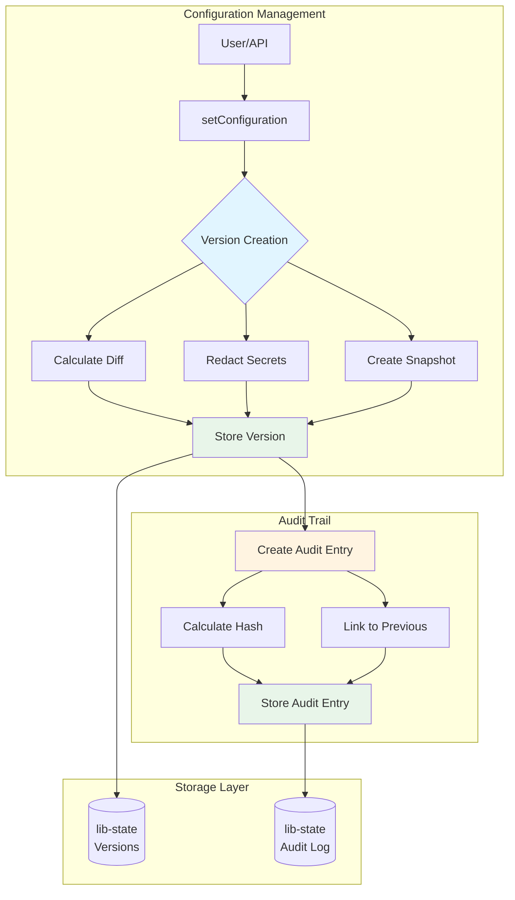
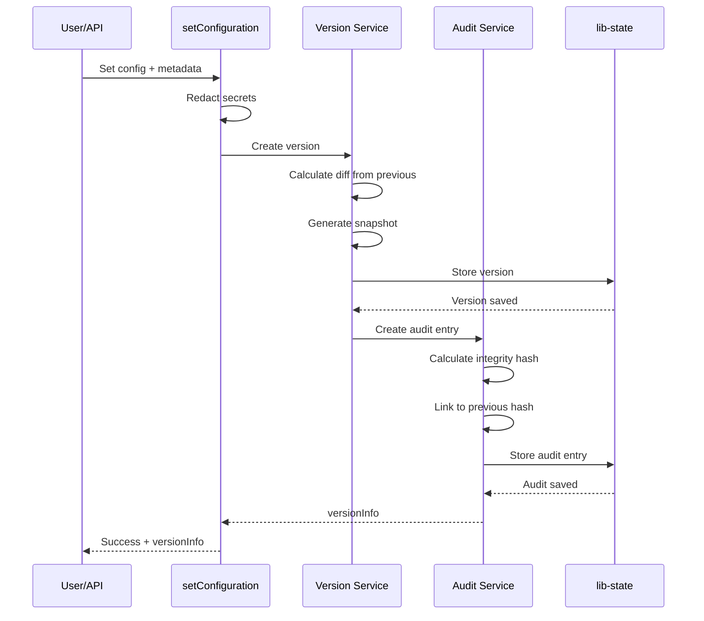
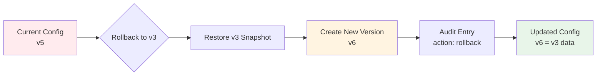
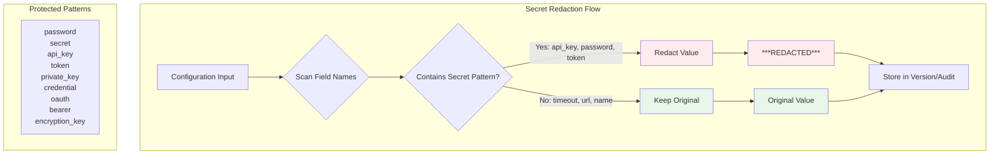
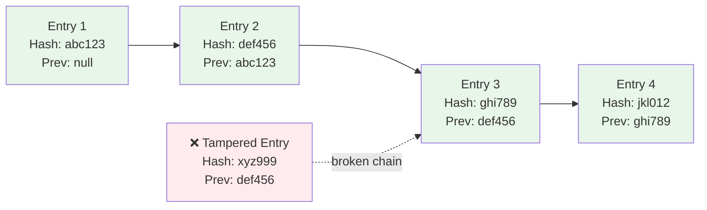
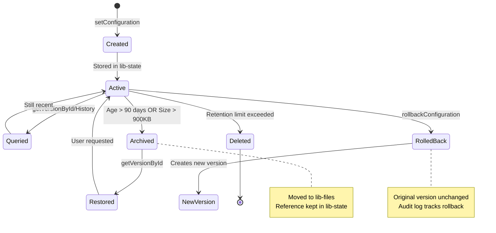

# Configuration Versioning and Audit Logging

The `@adobe/aio-commerce-lib-config` library provides comprehensive versioning and audit logging capabilities for configuration management. This ensures complete traceability of configuration changes while maintaining GDPR compliance.

## Features

### ✅ Configuration Versioning

- **Automatic versioning**: Every configuration change creates a new version
- **Diff calculation**: Each version stores the delta from the previous version
- **Full snapshots**: Complete configuration state at each version
- **Configurable retention**: Keep up to N versions (default: 25, configurable via `MAX_CONFIG_VERSIONS` env var)
- **Version history**: Query all historical versions for any scope

### ✅ Audit Logging

- **Immutable audit trail**: Every change is logged with integrity hashing
- **Chain verification**: SHA-256 hash chains ensure audit log integrity
- **Actor tracking**: Record who made each change (user ID, source, IP, user agent)
- **Action types**: Track creates, updates, and rollbacks
- **Queryable logs**: Filter by scope, user, action type, and date range

### ✅ GDPR Compliance

- **Automatic secret redaction**: Sensitive fields (passwords, API keys, tokens, etc.) are automatically redacted
- **Safe storage**: Secrets never stored in version history or audit logs
- **Change indicators**: Redacted fields show as `***REDACTED***` to indicate change without exposing values

## Architecture Overview



## Environment Variables

### `MAX_CONFIG_VERSIONS`

Controls the maximum number of versions to keep per scope.

```bash
# .env
MAX_CONFIG_VERSIONS=50  # Keep last 50 versions (default: 25)
```

When the limit is exceeded, the oldest version is automatically deleted.

## API Reference

### Setting Configuration (with Versioning)

The `setConfiguration` function now automatically creates versions and audit logs:



```typescript
import { setConfiguration, byScopeId } from "@adobe/aio-commerce-lib-config";

const result = await setConfiguration(
  {
    config: [
      { name: "api_key", value: "new-key-here" },
      { name: "timeout", value: 5000 },
    ],
    metadata: {
      actor: {
        userId: "admin@example.com",
        source: "admin-panel",
        ipAddress: "192.168.1.1",
        userAgent: "Mozilla/5.0...",
      },
    },
  },
  byScopeId("scope-123"),
);

console.log(result.versionInfo);
// {
//   versionId: "uuid-123",
//   versionNumber: 5
// }
```

### Get Configuration History

Retrieve the version history for a scope:

```typescript
import { getConfigurationHistory } from "@adobe/aio-commerce-lib-config";

const history = await getConfigurationHistory("my-scope", {
  limit: 10,
  offset: 0,
});

console.log(`Total versions: ${history.pagination.total}`);

history.versions.forEach((version) => {
  console.log(`Version ${version.versionNumber} (${version.timestamp}):`);
  console.log(`  Changes: ${version.diff.length}`);

  version.diff.forEach((change) => {
    if (change.type === "modified") {
      console.log(
        `    ${change.name}: ${change.oldValue} → ${change.newValue}`,
      );
    } else if (change.type === "added") {
      console.log(`    ${change.name}: (added) ${change.newValue}`);
    } else {
      console.log(`    ${change.name}: (removed)`);
    }
  });
});
```

### Get Audit Log

Query the audit log with filters:

```typescript
import { getAuditLog } from "@adobe/aio-commerce-lib-config";

// Get all audit entries for a scope
const auditLog = await getAuditLog({
  scopeCode: "my-scope",
  limit: 50,
  offset: 0,
});

// Filter by user and action
const userChanges = await getAuditLog({
  userId: "admin@example.com",
  action: "update",
  startDate: "2025-01-01T00:00:00Z",
  endDate: "2025-12-31T23:59:59Z",
});

userChanges.entries.forEach((entry) => {
  console.log(
    `${entry.timestamp}: ${entry.actor.userId} performed ${entry.action}`,
  );
  console.log(`  Version: ${entry.versionId}`);
  console.log(`  Changes: ${entry.changes.length}`);
  console.log(`  Integrity Hash: ${entry.integrityHash.substring(0, 16)}...`);
});
```

### Rollback Configuration

Restore configuration to a previous version:



```typescript
import { rollbackConfiguration } from "@adobe/aio-commerce-lib-config";

// Rollback to a specific version
const result = await rollbackConfiguration(
  "my-scope",
  "version-id-to-restore",
  {
    actor: {
      userId: "admin@example.com",
      source: "admin-panel",
    },
  },
);

console.log(`Rolled back to version ${result.versionInfo?.versionNumber}`);
console.log(`New version created: ${result.versionInfo?.versionId}`);
```

**Note**: Rollback creates a new version (it doesn't delete history). The audit log records this as a "rollback" action.

### Get Version Comparison (Before/After View)

Perfect for UI display showing what changed in a specific version:

```typescript
import { getVersionComparison } from "@adobe/aio-commerce-lib-config";

const comparison = await getVersionComparison("my-scope", "version-id-123");

if (comparison) {
  console.log("=== BEFORE ===");
  comparison.before.forEach((item) => {
    console.log(`${item.name}: ${item.value}`);
  });

  console.log("\n=== AFTER ===");
  comparison.after.forEach((item) => {
    console.log(`${item.name}: ${item.value}`);
  });

  console.log("\n=== CHANGES ===");
  comparison.changes.forEach((change) => {
    if (change.type === "modified") {
      console.log(`${change.name}: ${change.oldValue} → ${change.newValue}`);
    } else if (change.type === "added") {
      console.log(`${change.name}: (added) ${change.newValue}`);
    } else {
      console.log(`${change.name}: (removed)`);
    }
  });
}
```

### Compare Two Versions

Compare any two versions side-by-side (perfect for "diff" views):

```typescript
import { compareVersions } from "@adobe/aio-commerce-lib-config";

const comparison = await compareVersions(
  "my-scope",
  "version-5-id",
  "version-10-id",
);

if (comparison) {
  console.log(
    `Comparing v${comparison.fromVersion.versionNumber} to v${comparison.toVersion.versionNumber}`,
  );
  console.log(`Total changes: ${comparison.changes.length}`);

  // Display in a table or diff view
  comparison.changes.forEach((change) => {
    console.log(`\n${change.name}:`);
    console.log(
      `  Before (v${comparison.fromVersion.versionNumber}): ${change.oldValue}`,
    );
    console.log(
      `  After  (v${comparison.toVersion.versionNumber}): ${change.newValue}`,
    );
    console.log(`  Change type: ${change.type}`);
  });
}
```

### Get Specific Version by ID

Retrieve a complete version with all its details:

```typescript
import { getVersionById } from "@adobe/aio-commerce-lib-config";

const version = await getVersionById("my-scope", "version-id-123");

if (version) {
  console.log(`Version ${version.versionNumber}`);
  console.log(`Created: ${version.timestamp}`);
  console.log(`By: ${version.actor?.userId || "unknown"}`);
  console.log(`Changes: ${version.diff.length}`);
  console.log(`Total config items: ${version.snapshot.length}`);

  // Display the full configuration at this version
  version.snapshot.forEach((item) => {
    console.log(`  ${item.name}: ${item.value}`);
  });
}
```

## App Builder Actions

When using the action generator, the following action templates are available:

### 1. Get Configuration History Action

```bash
@adobe/aio-commerce-lib-config generate actions
```

Creates `get-configuration-history.js` action:

```javascript
// Usage in App Builder
const params = {
  scopeCode: "my-scope",
  limit: 25,
  offset: 0,
};

const response = await main(params);
// Returns version history
```

### 2. Get Audit Log Action

Creates `get-audit-log.js` action:

```javascript
// Usage in App Builder
const params = {
  scopeCode: "my-scope",
  userId: "admin@example.com",
  action: "update",
  limit: 50,
};

const response = await main(params);
// Returns filtered audit log entries
```

### 3. Rollback Configuration Action

Creates `rollback-configuration.js` action:

```javascript
// Usage in App Builder
const params = {
  scopeCode: "my-scope",
  versionId: "uuid-to-restore",
  actor: {
    userId: "admin@example.com",
    source: "admin-panel",
  },
};

const response = await main(params);
// Performs rollback and returns result
```

### 4. Get Version Comparison Action (NEW)

Creates `get-version-comparison.js` action - Perfect for UI before/after views:

```javascript
// Usage in App Builder
const params = {
  scopeCode: "my-scope",
  versionId: "version-id-123",
};

const response = await main(params);
// Returns: { version, before, after, changes }

// Display in UI
response.body.changes.forEach((change) => {
  if (change.type === "modified") {
    console.log(`${change.name}: ${change.oldValue} → ${change.newValue}`);
  }
});
```

### 5. Compare Versions Action (NEW)

Creates `compare-versions.js` action - For side-by-side version comparison:

```javascript
// Usage in App Builder
const params = {
  scopeCode: "my-scope",
  fromVersionId: "version-5-id",
  toVersionId: "version-10-id",
};

const response = await main(params);
// Returns: { fromVersion, toVersion, fromConfig, toConfig, changes }

// Build a diff view in UI
const diffView = response.body.changes.map((change) => ({
  field: change.name,
  before: change.oldValue,
  after: change.newValue,
  changeType: change.type,
}));
```

## Security & Compliance

### GDPR-Compliant Secret Redaction



The following field name patterns are automatically identified as sensitive and redacted:

- `password` (e.g., `user_password`, `admin_password`)
- `secret` (e.g., `api_secret`, `client_secret`)
- `api_key` or `apiKey` (e.g., `stripe_api_key`)
- `token` (e.g., `access_token`, `auth_token`, `bearer_token`)
- `private_key` (e.g., `rsa_private_key`)
- `credential` (e.g., `database_credentials`)
- `oauth`, `bearer`, `encryption_key`

Example:

```typescript
// Original configuration
const config = [
  { name: "api_key", value: "sk_live_abc123xyz" },
  { name: "timeout", value: 5000 },
];

// In version history and audit logs
const version = {
  snapshot: [
    { name: "api_key", value: "***REDACTED***" }, // ✅ Secure!
    { name: "timeout", value: 5000 }, // ✅ Normal value
  ],
  diff: [
    {
      name: "api_key",
      oldValue: "***REDACTED***", // ✅ Change recorded but value hidden
      newValue: "***REDACTED***",
      type: "modified",
    },
  ],
};
```

### Audit Chain Integrity

Each audit entry includes:

1. **Integrity Hash**: SHA-256 hash of the entry data
2. **Previous Hash**: Reference to previous entry's hash
3. **Chain Verification**: Detect any tampering or missing entries



```typescript
import { verifyAuditChain } from "@adobe/aio-commerce-lib-config/modules/audit";

const result = await verifyAuditChain(
  { namespace: "my-namespace" },
  "my-scope",
);

if (result.valid) {
  console.log("✅ Audit chain is intact");
} else {
  console.error(`❌ Audit chain broken at: ${result.brokenAt}`);
}
```

## Data Model

### Version Lifecycle



### ConfigVersion

```typescript
type ConfigVersion = {
  id: string; // Unique version ID (UUID)
  scope: {
    id: string;
    code: string;
    level: string;
  };
  snapshot: ConfigValue[]; // Full configuration at this version
  diff: ConfigDiff[]; // Changes from previous version
  timestamp: string; // ISO 8601 timestamp
  previousVersionId: string | null; // Previous version (null for first)
  versionNumber: number; // Incremental number
  actor?: {
    // Who made the change
    userId?: string;
    source?: string;
  };
};
```

### AuditEntry

```typescript
type AuditEntry = {
  id: string; // Unique audit entry ID (UUID)
  timestamp: string; // ISO 8601 timestamp
  scope: {
    id: string;
    code: string;
    level: string;
  };
  versionId: string; // Associated version ID
  actor: {
    // Who made the change
    userId?: string;
    source?: string;
    ipAddress?: string;
    userAgent?: string;
  };
  changes: ConfigDiff[]; // GDPR-compliant changes
  integrityHash: string; // SHA-256 hash for verification
  previousHash: string | null; // Previous entry hash (chain)
  action: "create" | "update" | "rollback";
};
```

## Best Practices

### 1. Always Include Actor Information

```typescript
// ✅ Good: Include actor metadata
await setConfiguration(
  {
    config: [...],
    metadata: {
      actor: {
        userId: req.user.email,
        source: "admin-api",
        ipAddress: req.ip,
      },
    },
  },
  selector
);

// ❌ Bad: No actor information
await setConfiguration({ config: [...] }, selector);
```

### 2. Query Audit Logs for Compliance

```typescript
// Monthly compliance report
const lastMonth = await getAuditLog({
  startDate: "2025-01-01T00:00:00Z",
  endDate: "2025-01-31T23:59:59Z",
  limit: 1000,
});

const report = {
  totalChanges: lastMonth.pagination.total,
  byUser: groupBy(lastMonth.entries, (e) => e.actor.userId),
  byAction: groupBy(lastMonth.entries, (e) => e.action),
};
```

### 3. Monitor Version Limits

```typescript
// Check if approaching version limit
const history = await getConfigurationHistory("critical-scope");

if (history.pagination.total >= 20 && MAX_VERSIONS === 25) {
  logger.warn(
    "Approaching version limit, consider increasing MAX_CONFIG_VERSIONS",
  );
}
```

### 4. Use Rollback Carefully

```typescript
// Always verify before rollback
const targetVersion = history.versions.find((v) => v.versionNumber === 42);

if (!targetVersion) {
  throw new Error("Version not found");
}

// Check what will change
console.log("Rolling back to:", targetVersion.timestamp);
console.log("Changes that will be reverted:", targetVersion.diff);

// Confirm with user before proceeding
const confirmed = await confirmRollback();
if (confirmed) {
  await rollbackConfiguration(scopeCode, targetVersion.id, metadata);
}
```

## Storage

All versioning and audit data is stored using `@adobe/aio-lib-state` following [Adobe's best practices for database storage](https://developer.adobe.com/commerce/extensibility/app-development/best-practices/database-storage/).

### Storage Keys

- **Versions**: `version:{scopeCode}:{versionId}`
- **Version Metadata**: `version-meta:{scopeCode}`
- **Version Lists**: `version-list:{scopeCode}` (index of version IDs)
- **Audit Entries**: `audit:{auditId}`
- **Audit Lists**: `audit-list:{scopeCode}` (index of audit IDs)

Data is stored with `ttl: -1` (never expires) to ensure compliance and auditability.

### Index-Based Pattern

Following Adobe's recommended pattern, we maintain indexes (arrays of IDs) for efficient pagination:

```mermaid
flowchart TB
    subgraph "Query Process"
        A[Get History Request<br/>limit: 10, offset: 20] --> B[Fetch Index]
        B --> C[version-list:my-scope]
        C --> D[Array of 100 IDs]
        D --> E[Slice: IDs[20:30]]
        E --> F[Parallel Fetch<br/>10 versions]
        F --> G[Return Results]
    end

    subgraph "Storage Structure"
        H[(lib-state)]
        I[version-list:my-scope<br/>IDs array]
        J[version:my-scope:v1<br/>Full data]
        K[version:my-scope:v2<br/>Full data]
        L[version:my-scope:v3<br/>Full data]

        H --> I
        H --> J
        H --> K
        H --> L
    end

    style E fill:#fff4e1
    style F fill:#e1f5ff
```

```typescript
// Version index example
["version-1-id", "version-2-id", "version-3-id", ...]

// Pagination:
// 1. Get the index (array of IDs)
// 2. Slice the index for the page
// 3. Fetch individual versions in parallel
```

This approach works around `lib-state` limitations:

- ✅ No SQL-like queries needed
- ✅ Efficient parallel fetching by ID
- ✅ Simple pagination logic
- ✅ Scales well for reasonable data volumes

### Adobe I/O State Limitations

Be aware of these `lib-state` constraints:

- **Maximum value size**: 1MB per entry
- **Maximum key size**: 1024 bytes
- **No SQL queries**: Cannot filter/select like a traditional database
- **No column selection**: Must fetch entire entries

**Our implementation handles these:**

- ✅ **Size validation**: Version saves throw `StorageLimitExceededError` if >1MB
- ✅ **Index-based filtering**: Maintain ID lists for efficient queries
- ✅ **Parallel fetching**: Load multiple entries simultaneously
- ✅ **Pagination**: Slice index before fetching to limit data transfer

### Storage Monitoring

**Recommended practices:**

1. **Monitor version sizes**: Large configurations may approach the 1MB limit
2. **Archive old data**: For long-running systems, consider moving old versions to `lib-files`
3. **Index maintenance**: Indexes grow linearly with entries
4. **Retention limits**: Use `MAX_CONFIG_VERSIONS` to control storage growth

**Example size calculation:**

```typescript
import { getValueSize } from "@adobe/aio-commerce-lib-config/utils/storage-limits";

const version = await getVersionById("my-scope", "version-id");
const sizeInKB = getValueSize(version) / 1024;

if (sizeInKB > 900) {
  // Approaching 1MB limit
  console.warn(`Large version detected: ${sizeInKB}KB`);
  // Consider reducing snapshot size or archiving to lib-files
}
```

### When to Use lib-files Instead

Per [Adobe's guidance](https://developer.adobe.com/commerce/extensibility/app-development/best-practices/database-storage/), use `lib-files` for:

- **Large data** (>1MB): Store large configuration exports
- **Credentials**: More secure, segregated blob storage
- **Archives**: Move old versions to files for long-term storage

Use `lib-state` (current implementation) for:

- **Active versions**: Recent configuration versions
- **Fast access**: Sub-second read/write operations
- **Small values**: Individual config entries, metadata
- **High throughput**: Frequent reads/writes
